# plotlet

A $20 pen-plotter design that you can (almost) entirely 3D-print yourself. Optionally wireless: Bluetooth-operated and battery powered with upgrades.

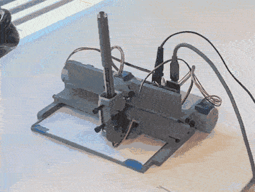

While not as fast or accurate as a full-blown plotter with metal parts and big motors, this delightful little machine is surprisingly capable for a tiny fraction of the cost. The default work area is the size of a postcard (6''x4''), while a simple modification allows it to cover 6''x ∞.

## Gallery

Below are some plots made with the plotter. Click on the image to enlarge.

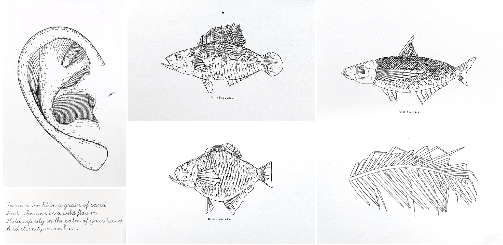
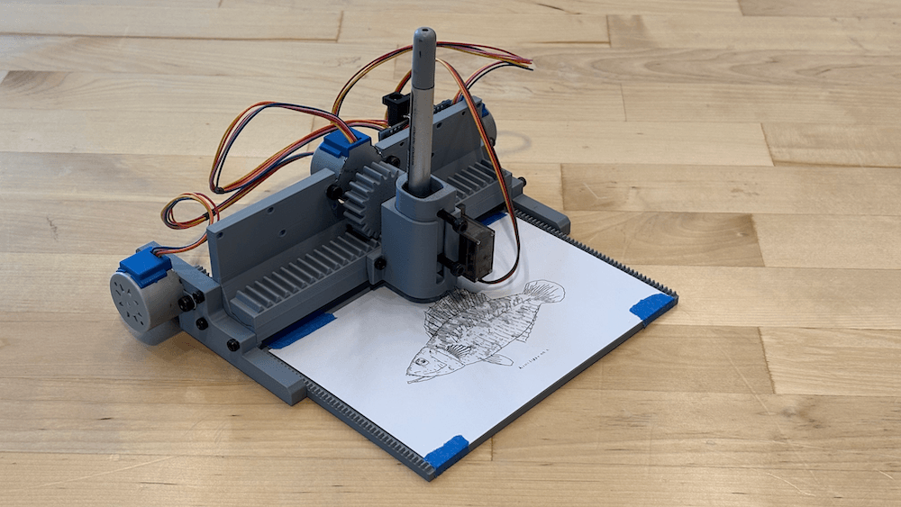
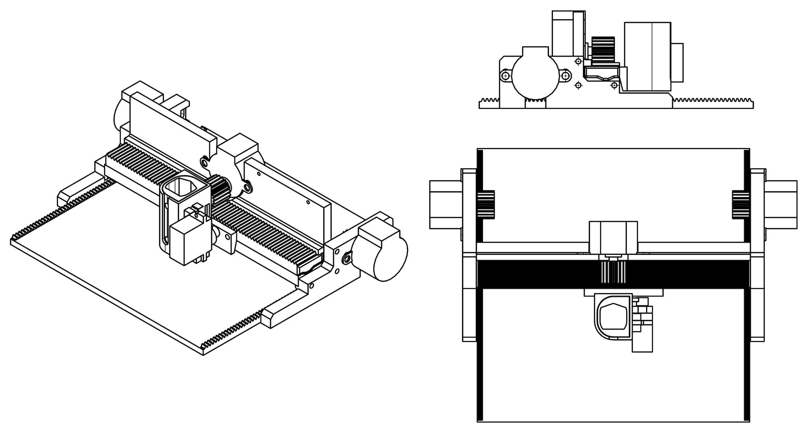

## BOM

| Part                          | Qty | Unit Cost | Cost*    | Link |
|-------------------------------|-----|-----------|----------|------|
| Stepper 28BYJ48 12V w/ driver |  3  | $2.4      | $7.2     | [Amazon](https://www.amazon.com/dp/B0CZNGF43R) |
| Servo SG90                    |  1  | $1.8      | $1.8     | [Amazon](https://www.amazon.com/dp/B0D6FR6WYV) |
| M2/M3/M4 bolts & nuts*        | 21  | $0.01     | $0.23    | [Amazon](https://www.amazon.com/dp/B0FJFVG31G) |
| 3D printer filament           | 150g| $14/kg    | $2.1     | [Amazon](https://www.amazon.com/dp/B07PGY2JP1) |
| 12V 1A Power Supply           |  1  | $4        | $4       | [Amazon](https://www.amazon.com/dp/B0FWC9LRYZ) |
| Arduino + wires*              |  1  | $5        | $5       | [Amazon](https://www.amazon.com/dp/B0DFGQW2ZY) |
| **Total**                     |     |           |**$20.3** |      |

* Cost is in US dollars.
* M2x12mm x1, M3x12mm x8, M4x12mm x8, M4 nuts x6. Additional screws required if electronics are to be fastened to plotter body.
* Minimal setup requires an Arduino Nano knockoff (or any Arduino board) and dupont wires. Or, upgrade to the custom, more integrated PCB found in [circuit/](circuit/) folder. More info and wiring help can be found in Wiring section below.


## 3D Printing

All parts can be 3D printed reliably with no support structure.

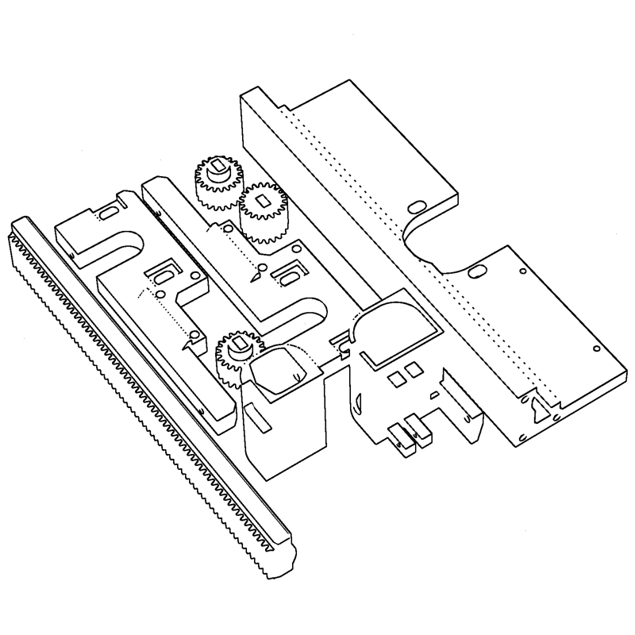

1. Download [plotter-standard.step](hardware/plotter-standard.step) from [hardware/](hardware/) folder.
2. In slicer, break into components, and delete non-3D-printed parts such as motors.
3. Orient each component such that the cross section with the most prominent feature is parrallel to the build plate (see above image for a recommanded arrangement).
4. In theory, all parts can be fit into a single 256x256mm plate (~4 hours on a Bambu printer), though it is recommanded to print the flatbed part separately.
5. The usual 0.2mm layer height, 2 wall loops, 15% infill, or simply sticking to slicer defaults should suffice.

## Assembly

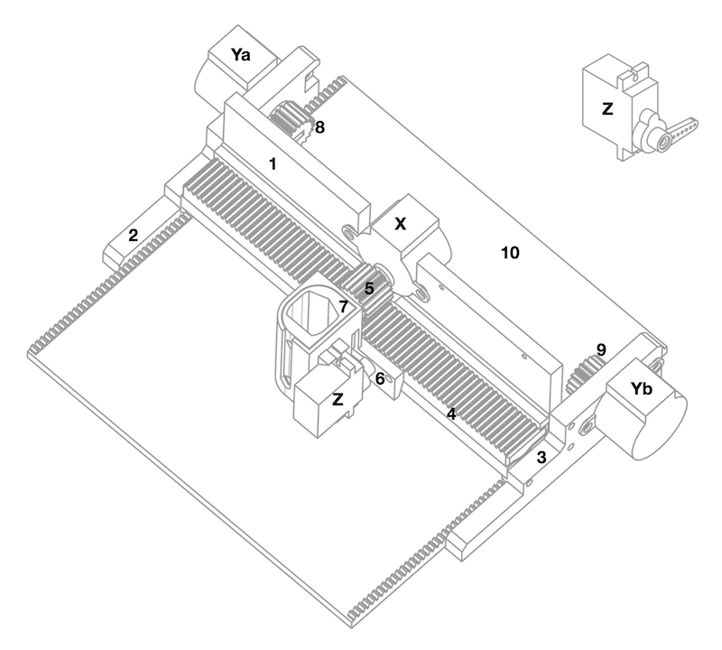

Before assembly, ensure servo motor Z is in the 90-degree (central) position, and attach single-armed servo horn as shown. You can turn/test a servo with [firmware/servo_calib_arduino](firmware/servo_calib_arduino).

1. Fasten motor Z to part 6 with 1x M2 bolts;
2. Fasten part 6 to part 4 with 2x M3 bolts;
3. Slide part 4 into part 1;
4. Attach part 5 to motor X;
5. Fasten motor X to part 1 with 2x M4 bolts and nuts, ensure gears mesh smoothly
6. Loosely attach motor Ya to part 2, Yb to 3, do not tighten;
7. Fasten part 2 and 3 to 1 with 3x M2 bolts each;
8. Place part 10, attach part 8 to Ya, 9 to Yb;
9. Tighten Ya to 2, Yb to 3, ensure gears mesh smoothly;
10. Fasten pen to part 7 with 2x M4 bolts, slide part 7 into part 6.

### Tips

- Well-assembled machines can achieve higher plotting accuracy.
- Depending on the type of pen and paper used, you can attach a weight onto the pen to make the Z carriage more heavy and make bolder marks.

## Wiring & Firmware

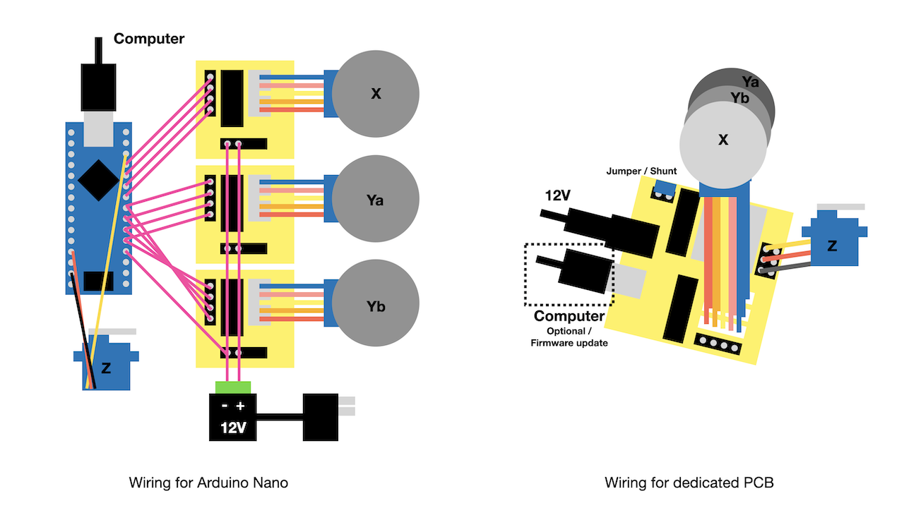

### Option 1: Quick and Dirty

The easiest way to get the circuit up and running, is to wire an Arduino Nano (or knockoff thereof) as shown in the image above. The ULN2003-based drivers typically come with stepper purchase.

Then upload [firmware/plotter_nano_arduino](firmware/plotter_nano_arduino) using Arduino IDE.

Other Arduino-compatible boards should also work, but you might need to modify the pin numbers.

### Option 2: Order PCB

A custom, dedicated PCB design is also included in this repo if you'd like a nicer solution. It is more compact, less cable management, and enables plotting via Bluetooth.

The EasyEDA project can be found at [circuit/plotter-esp.epro](circuit/plotter-esp.epro). The schematic is also available as an image at [circuit/plotter-esp-sch.png](circuit/plotter-esp-sch.png), and gerber files, the BOM, and pick and place file are also available in the same folder.

All the components are easily hand-solderable. The ULN2003 chips can be detached from the driver boards that come with stepper purchase, and soldered or socketed to this board. After assembly, wire as shown in the above image.

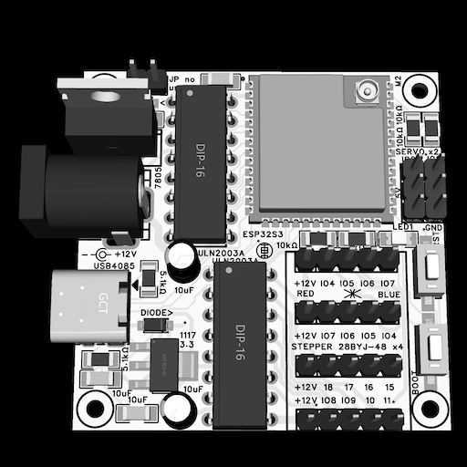

To additionally power the microcontroller and servo motor from the 12V power supply (thus eliminating the need for the USB-C cable when communicating via Bluetooth), short the jumper labelled "JP no usb" with a shunt or wire. If you do so, attach a heatsink to the 7805 for good measure.

Then upload [firmware/plotter_esp_arduino](firmware/plotter_esp_arduino) using Arduino IDE. Ensure USB CDC, USB JTAG are enabled in the Tools menu.

### Other Options

You can also use an ESP32-S3 dev board with [firmware/plotter_esp_arduino](firmware/plotter_esp_arduino) firmware and wire / edit pin numbers accordingly.

You can also make a proto/perf/strip board following either design, as a middle ground, which was how I made the first version of the circuit.

### A Note on Steppers

This project uses the 12V version of 28BYJ48 instead of the 5V version, since it has higher torque per [datasheet](https://www.aksotronik.com.pl/media/products_files/009433.pdf). However, the 5V version can probably be made to work too. In this case, use a 5V power supply, and for the custom PCB, short the input and output pins of the 7805.

## Protocol

The plotter understands a simple GCODE-like language inspired by SVG paths, sent via serial (baud rate 115200). Currently there are only two commands. For **relative**, **l**inear move on the XY-plane (unit in steps, case-sensitive):

```
l100,200\n
```

For **absolute** positioning of the **Z**-axis (unit in degrees):

```
Z150\n
```

There're approximately 1600 steps along the X-axis (800 in either direction), and 1000 steps along the Y-axis (if using the default 6''x4'' bed). For Z-axis, 90deg is the pen-down position, while 150deg is the pen-up position. e.g. to draw a square:

```
Z90
l100,0
l0,100
l-100,0
l0,-100
Z150
```

Numbers must be integers. Commands are sent one at a time to the firmware, terminated by "\n". Only upon receiving the string "OK\n" back, may the software send the next command.

The easiest way to test is by opening Arduino IDE's serial monitor, set baud to 115200, line ending to newline and type the commands to send.

The machine itself does not have a notion of "home", and will start moving from whatever position it is currently at. However, it is recommanded that you set up by moving the gear rack of X axis squarely to the center with no part protruding out of either side, and align the pen with the upper edge of the workpiece. In this case, the coordinate of the four corners will be (-800,0), (800,0), (-800,1000) and (800,1000).

For bluetooth communication, the commands follow the same format, but are written to a BLE characteristic, and the "\n" may be omitted. Upon completion, the firmware overwrites the characteristic with "OK".

The syntax is chosen for simplicity and direct mapping to the hardware (which is simple itself). If you somehow prefer real GCODE, you can try to flash [grbl firmware](https://github.com/grbl/grbl) onto the board (and share your results).

## Software

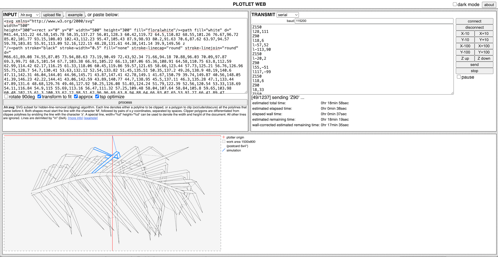

The easiest way to send jobs to the plotter is via the web interface located in [software/](software/). To launch, start a local server in the folder, e.g.

```
cd software
python3 -m http.server
```

Then open the page in **Chrome** browser, as it uses Web Serial and Web Bluetoth, which are not supported by some browsers such as Safari. You can check compatibility [here](https://developer.mozilla.org/en-US/docs/Web/API/Web_Bluetooth_API#browser_compatibility), [here](https://developer.mozilla.org/en-US/docs/Web/API/Web_Serial_API#browser_compatibility) and [here](https://caniuse.com/).

### Input Format

There are a few options from the drop-down menu:

- The most convenient one is probably SVG. SVG is a common format for vector graphics. You can find some [samples from w3.org](https://dev.w3.org/SVG/tools/svgweb/samples/svg-files). If you used p5.js to generate the drawing, you can use [p5.plotSvg](https://github.com/golanlevin/p5.plotSvg) to make an SVG.

- The tool also support **.hlr.svg**, a custom subset of SVG for pre-processing with a clipping / [hidden line removal](https://en.wikipedia.org/wiki/Hidden-line_removal) algorithm. The basic idea is, on a screen, if you draw an opaque shape on top of another, the one underneath will be eclipsed (a.k.a. [painter's algorithm](https://en.wikipedia.org/wiki/Painter%27s_algorithm)). However, plotters typically does not have a means of erasing what was already drawn. This format allows you to specify shapes that clip others v.s. shapes that are clipped by others, so the pre-processing algorithm can compile a list of clipped shapes than can be plotted directly. The algorithm and format are initially developed for [this drawing with 0.3 million shapes](https://github.com/LingDong-/galiano-drawing). Format spec and more info in the in-app tooltips.

- Of course, plain old **polylines** are also supported, which takes the form of a JSON/JavaScript array: `[[[x0,y0],[x1,y1],...],...]`. This option is perhaps the most convenient if you're generating the drawing algorithmically and know what you're doing, since it doesn't involve a round trip to another format.

- Finally, with the **text** option, you can type some text and have them plotted with [single-stroke font](https://paulbourke.net/dataformats/hershey/). This should mostly be for testing, and if you need any fancy typographic features, you should generate your own and encode in any of the other formats above.

### Post-Processing

- **rotate 90degs**: switch from portrait to landscape and vice versa.
- **transform to fit**: fit the drawing to the workarea and center it. A lazy option, and if you care about margins etc. you should generate the drawing with the correct dimensions (1px = 1step) yourself.
- **approx**: simplify the polylines before plotting, removing inconspicous details. (Uses [Doug-Peucker](https://en.wikipedia.org/wiki/Ramer%E2%80%93Douglas%E2%80%93Peucker_algorithm)).
- **tsp optimize**: minimize the distance of jumps between polylines by reordering them and/or flipping them. Approximate soltion to a variant of the [travelling salesperson's problem](https://en.wikipedia.org/wiki/Travelling_salesman_problem). Saves plotting time.

### Genrating Toolpath

Next, simply click the big "process" button. You'll see the commands generated in the big text box of the "Transmit" window. Alternatively, you can also paste raw commands into that text box directly, thereby skipping all the previous steps, for testing or fine control.

Verify that the drawing is parsed and positioned as expected in the preview window on the lower half of the page.

### Connecting

To plot, first you need to connect to the plotter. You can either use Bluetooth (BLE) if your circuit setup supports it (see previous sections), or the wired, Serial (USB) option, chosen from the drop-down menu. (Again, not all browsers support Web Bluetooth and Web Serial, and Chrome is recommanded). The default parameters should be fine as long as you didn't modify the firmware. Then click "connect". The browser should prompt you which device to pair with / connect to; select the most likely option.

You can test your connection and / or home your plotter by clicking the "X-10", "Y+100", "Z down" etc. buttons, which move the plotter's axes directly by sending corresponding commands.

### Plotting

Finally, click the "send" button to transmit the commands generated from your drawing. You can see a real-time simulation of the plotting process in the preview window, as well as status updates in the transmit window. Your plotter should be busy plotting the stuff, and you can drink some tea and wait.

If you encounter any problems, check the browser's [developer console](https://developer.chrome.com/docs/devtools/open). If you think it's a bug, let me know in the Issues section.

### Programmatic Control / Libraries

- example controlling from p5.js available at [https://editor.p5js.org/lingdong/sketches/d-jyu31fy](https://editor.p5js.org/lingdong/sketches/d-jyu31fy)

## Upgrades

### More Stable Z Axis for Pilot G2 Pens

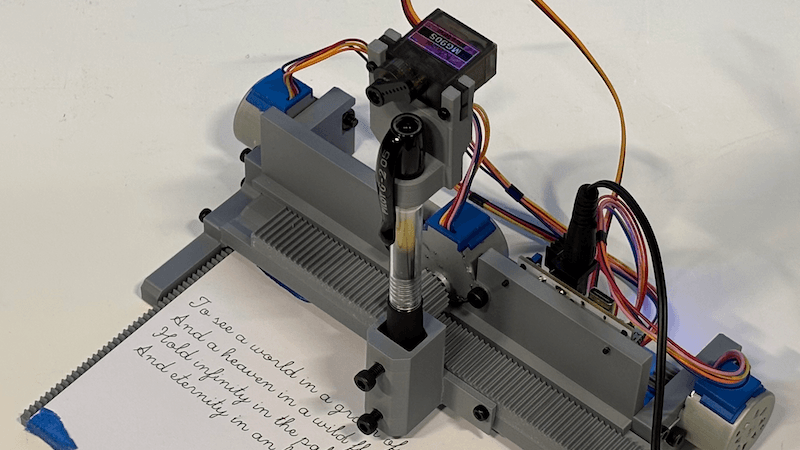

- The original Z axis causes some small give on the XY plane due to gap between 3D printed "carriage" and "rail". 
- Clicky pen (e.g. [Pilot G2](https://www.amazon.com/dp/B00006JNJ8)) retraction mechanism has much better manufacturing tolerance than 3D printed parts, and can be abused in place of Z axis.
- Download [hardware/plotter-alt-z-pilotg2.step](hardware/plotter-alt-z-pilotg2.step) and [hardware/plotter-alt-z-none.step](hardware/plotter-alt-z-none.step) and 3D print both.
- Before assembly, remove the spring in the G2 by unscrewing the pen body. Otherwise the servo can have trouble compressing it repeatedly over time. (It turns out, when the tip of G2 is lightly dragged over a surface, it does not leave a mark, pressure is required to do so, therefore, the spring is not needed)
- First assemble without fastening tightly. Make the pen tip protrude as far as possible, and let it press firmly on the paper. Now fasten tightly.
- The firmware can remain unchanged. Try plotting, and adjust assembly if pen is too low or too high.

### Infinite Y Axis with Timing Belts

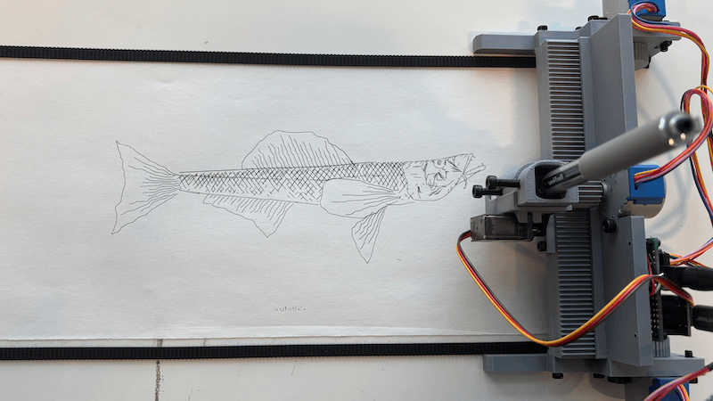

- Accquire [GT2-2M timing belts](https://www.amazon.com/dp/B097T3Y6WW).
- Download [hardware/plotter-alt-y-gt2.step](hardware/plotter-alt-y-gt2.step) and 3D print **2 copies**.
- Replace original Y axis gears with these, and loosen the bolts on Y axis stepper motors.
- Use double-sided tape (or some other adhesive) to install a pair of timing belts on a flat surface such as a tabletop.
- Sit the plotter on top of the timing belts, and tighten the bolts on Y axis steppers.
- The new gears are 1.5x larger, therefore Y axis will be 1.5x faster/coarser, and all drawings sent need to be vertically scaled by 66% to keep proportions.


